Upon reviewing the provided Mermaid chart against the previous text description of CloudCore Networks' organizational structure, here are the key points of alignment and discrepancies:

### **Alignment with the Text Description:**
- The chart correctly represents the top-level structure with the CEO overseeing the CISO, CIO, COO, CFO, CCO, and Head of Legal, which aligns with the described hierarchy.
- The CISO, CIO, COO, CFO, and CCO have their respective departments under them, showing clear reporting lines as described.
- The chart includes detailed sub-teams under each executive, such as Security Operations under the CISO and IT Department under the CIO, which matches the roles and responsibilities outlined in the description.

### **Discrepancies and Areas for Improvement:**
1. **CFO's Structure:**
   - The CFO's reporting lines in the chart only include "Budgeting" and "Financial Risk Management," which aligns with the summary but lacks further detail about potential sub-teams such as accounting or other finance-related functions mentioned indirectly in the broader description.

2. **CTO and Their Team:**
   - The text description included a CTO (Chief Technology Officer) overseeing technology development and innovation, which is missing from the chart. Adding the CTO and their associated teams would align the chart more closely with the described structure.

3. **Head of Legal and HR:**
   - The Head of Legal is correctly placed under the CEO, but further connections, such as interactions with Compliance and Security during a breach, are not fully detailed in the chart.
   - The HR head is positioned correctly under the COO, but the chart does not show specific HR functions like security training coordination with the CISO, which was highlighted in the text.

4. **Customer Support:**
   - Customer Support's interaction with Security (CISO) for breach communications is not depicted, which is important in a breach scenario context as described in the text.

### **Updated Mermaid Chart:**
Here’s an updated Mermaid chart incorporating the above corrections and additions:

```mermaid
graph TD
    CEO(CEO)
    
    CISO(CISO)
    CIO(CIO)
    COO(COO)
    CFO(CFO)
    CCO(CCO)
    CTO(CTO)
    
    SecurityOps(Security Operations Team)
    IncidentResponse(Incident Response Team)
    ThreatAnalysis(Threat Analysis Team)
    
    ITDept(IT Department)
    NetworkInfra(Network Infrastructure)
    AppSupport(Application Support)
    ITSecurity(IT Security)
    
    Operations(Operations Managers)
    ProjectManagers(Project Managers)
    ServiceDelivery(Service Delivery)
    
    Finance(Budgeting)
    FinancialRisk(Financial Risk Management)
    Accounting(Accounting)
    
    ComplianceManagers(Compliance Managers)
    Auditors(Compliance Auditors)
    LegalLiaison(Legal Liaison)
    
    Legal(Head of Legal)
    HR(Head of HR)
    CustomerSupport(Head of Customer Support)
    
    SecuritySpecialists(Cybersecurity Specialists)
    ITSupport(IT Support)
    ITSecurityMonitoring(IT Security Monitoring)
    CloudMgmt(Cloud Management)
    SupportTeams(Support Teams)
    ComplianceAnalysts(Compliance Analysts)
    PolicyTeams(Policy Teams)
    
    CEO --> CISO
    CEO --> CIO
    CEO --> COO
    CEO --> CFO
    CEO --> CCO
    CEO --> Legal
    CEO --> CTO
    
    CISO --> SecurityOps
    CISO --> IncidentResponse
    CISO --> ThreatAnalysis
    SecurityOps --> SecuritySpecialists
    
    CIO --> ITDept
    ITDept --> NetworkInfra
    ITDept --> AppSupport
    ITDept --> ITSecurity
    ITSecurity --> ITSupport
    ITSecurity --> ITSecurityMonitoring
    ITSecurity --> CloudMgmt
    
    COO --> Operations
    Operations --> ProjectManagers
    Operations --> ServiceDelivery
    COO --> HR
    COO --> CustomerSupport
    CustomerSupport --> SupportTeams
    
    CFO --> Finance
    Finance --> FinancialRisk
    Finance --> Accounting
    
    CCO --> ComplianceManagers
    ComplianceManagers --> Auditors
    ComplianceManagers --> LegalLiaison
    CCO --> ComplianceAnalysts
    CCO --> PolicyTeams
    
    HR --> SecuritySpecialists
    Legal --> ComplianceManagers
    
    CTO --> TechDev(Technology Development)
    CTO --> Innovation(Innovation Team)
```

This updated chart aligns more accurately with the text description and includes all the described departments and their interactions, particularly highlighting their roles in breach scenarios.