Here's the organizational chart for CloudCore Networks in Mermaid markdown format, which you can use to visualize the structure and reporting lines among departments, especially in the context of a breach scenario:

```mermaid
graph TD
    CEO(CEO)
    
    CISO(CISO)
    CIO(CIO)
    COO(COO)
    CFO(CFO)
    CCO(CCO)
    
    SecurityOps(Security Operations Team)
    IncidentResponse(Incident Response Team)
    ThreatAnalysis(Threat Analysis Team)
    
    ITDept(IT Department)
    NetworkInfra(Network Infrastructure)
    AppSupport(Application Support)
    ITSecurity(IT Security)
    
    Operations(Operations Managers)
    ProjectManagers(Project Managers)
    ServiceDelivery(Service Delivery)
    
    Finance(Budgeting)
    FinancialRisk(Financial Risk Management)
    
    ComplianceManagers(Compliance Managers)
    Auditors(Compliance Auditors)
    LegalLiaison(Legal Liaison)
    
    Legal(Head of Legal)
    HR(Head of HR)
    CustomerSupport(Head of Customer Support)
    
    SecuritySpecialists(Cybersecurity Specialists)
    ITSupport(IT Support)
    ITSecurityMonitoring(IT Security Monitoring)
    CloudMgmt(Cloud Management)
    SupportTeams(Support Teams)
    ComplianceAnalysts(Compliance Analysts)
    PolicyTeams(Policy Teams)
    
    CEO --> CISO
    CEO --> CIO
    CEO --> COO
    CEO --> CFO
    CEO --> CCO
    CEO --> Legal
    
    CISO --> SecurityOps
    CISO --> IncidentResponse
    CISO --> ThreatAnalysis
    
    SecurityOps --> SecuritySpecialists
    
    CIO --> ITDept
    ITDept --> NetworkInfra
    ITDept --> AppSupport
    ITDept --> ITSecurity
    ITSecurity --> ITSupport
    ITSecurity --> ITSecurityMonitoring
    ITSecurity --> CloudMgmt
    
    COO --> Operations
    Operations --> ProjectManagers
    Operations --> ServiceDelivery
    COO --> HR
    COO --> CustomerSupport
    CustomerSupport --> SupportTeams
    
    CFO --> Finance
    Finance --> FinancialRisk
    
    CCO --> ComplianceManagers
    ComplianceManagers --> Auditors
    ComplianceManagers --> LegalLiaison
    CCO --> ComplianceAnalysts
    CCO --> PolicyTeams
    
    HR --> SecuritySpecialists
```

### Explanation:
- The chart displays the top-level executives and their reporting departments.
- Each key executive (CISO, CIO, COO, CFO, CCO) oversees relevant teams and functions.
- This structure emphasizes the cross-functional nature of the security response, showing how teams interact during a breach scenario.

You can use this Mermaid markdown to visualize the organizational chart, making it easier for students to grasp the company's structure and understand the flow of responsibilities during a security incident.